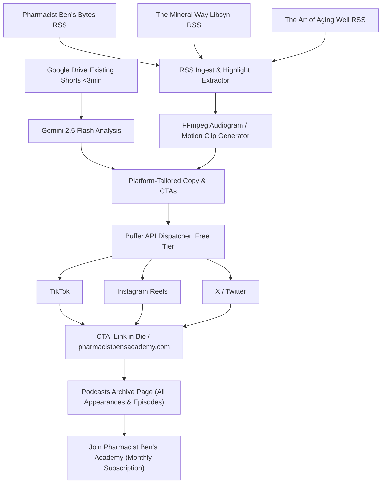

# Pharmacist Ben's Social Media Hub & Promotion Engine

A multi-tiered, serverless promotional engine built to drive high-intent traffic to [pharmacistbensacademy.com](https://pharmacistbensacademy.com) (specifically the Podcasts archive page and membership academy) by distributing short-form motion video, GIFs, and high-converting copy across TikTok, Instagram Reels, and X via Buffer.

---

## Strategic Goals & Conversion Funnel



1. **Traffic Funnel Target**:
   * Direct viewers to `pharmacistbensacademy.com` (Podcasts directory) to browse all of Pharmacist Ben's appearances, interviews, and archives.
   * Secondary conversion: Convert listeners into recurring monthly Academy members.
2. **Social Channels (Buffer Free Tier - 3 Channels)**:
   * **TikTok** (9:16 vertical video + punchy caption)
   * **Instagram Reels** (9:16 vertical video + engagement copy + "Link in bio")
   * **X / Twitter** (Concise <280 char hook with motion video or animated GIF + direct clickable URL)

---

## User Review Required

> [!IMPORTANT]
> **Buffer Video Ingestion Requirement**:
> Buffer's API requires a publicly reachable URL (`media_url`) to attach video files to posts. Since videos are processed on a GitHub Actions runner, we will automatically upload the processed clip back to an `output_clips/` folder in your Google Drive, set its permission to "Anyone with the link can view", and provide that direct stream URL to Buffer.

> [!NOTE]
> **Phased Rollout**:
> * **Phase 1 (Immediate)**: Process and post existing Google Drive shorts (<3 min), burning visual hook/CTA banners and dispatching platform-specific captions driving to `pharmacistbensacademy.com`.
> * **Phase 2 (Podcast Feeds)**: Integrate RSS ingestion for the 3 feeds (*Pharmacist Ben's Bytes*, *The Mineral Way*, and *The Art of Aging Well*), generating dynamic vertical audiograms/motion clips from audio episodes.

---

## Proposed System Architecture

```text
podcast-promo-engine/
├── .github/
│   └── workflows/
│       └── pipeline.yml           # Daily automated cron runner
├── dashboard/
│   ├── index.html                 # Master Hub Web Interface UI
│   └── styles.css                 # Sleek dark-mode aesthetic styling
├── src/
│   ├── config.py                  # Environment config & secrets validation
│   ├── drive_sync.py              # Google Drive downloader & public clip uploader
│   ├── rss_ingest.py              # Ingestion for the 3 podcast RSS feeds
│   ├── gemini_processor.py        # Multimodal analysis, hooks, and conversion CTAs
│   ├── video_cutter.py            # FFmpeg 9:16 vertical cutter + text overlay
│   ├── audiogram_generator.py     # Converts podcast audio snippets to vertical motion video / GIF
│   ├── buffer_publisher.py        # Buffer API queue manager (10-post cap) & dispatcher
│   ├── skool_generator.py         # Skool community interactive HTML quiz generator
│   └── sheets_reporter.py         # Google Sheets metrics logger
├── templates/
│   └── quiz_template.html         # Embeddable interactive quiz template
├── data/
│   └── processed.json             # Manifest tracking processed video IDs and RSS GUIDs
├── main.py                        # Master pipeline orchestrator
├── server.py                      # Master Hub local server & execution API
├── requirements.txt
└── README.md
```

---

## Detailed Implementation Plan

### 1. High-Converting Copy & CTA Engine (`src/gemini_processor.py`)
* **Editorial Persona**: Grounded in Pharmacist Ben's core philosophy (cellular energy, the 90 essential nutrients, root-cause biochemistry, no synthetic "miracle cures").
* **Conversion CTAs**:
  * **TikTok / Instagram**: *"Want the full story on cellular healing? Explore the full archive of Pharmacist Ben's podcast appearances at pharmacistbensacademy.com (link in bio) and discover how to master your biology."*
  * **X / Twitter**: Direct, clickable link: *"Dive deeper into root-cause biology and listen to the full episode on the archive: pharmacistbensacademy.com/podcasts"*
* **Platform Specialization**:
  * TikTok: Hook-focused, fast-paced, trending format hashtags.
  * Instagram: Educational micro-lesson with save/share prompts and clear Link-in-Bio instruction.
  * X: Punchy thread-starter or single tweet under 280 characters with direct link.

### 2. Video Processing & Motion Generation (`src/video_cutter.py` & `src/audiogram_generator.py`)
* **Existing Drive Shorts (<3 min)**:
  * FFmpeg crops/centers to 9:16 (1080x1920).
  * Burns a high-contrast top headline hook and a lower-third CTA banner: `"Full Archive @ PharmacistBensAcademy.com"`.
  * Fixes font pathing for Linux runners (`/usr/share/fonts/truetype/dejavu/DejaVuSans-Bold.ttf`) and properly escapes single quotes/colons.
* **Podcast Audio RSS Feeds (Phase 2)**:
  * RSS feeds parsed via `feedparser`.
  * Gemini identifies the 30–60 second "golden nugget" timestamp.
  * `audiogram_generator.py` blends Pharmacist Ben's show artwork / branding with a dynamic animated waveform or motion text, outputting an MP4 or high-framerate GIF formatted for social feeds.

### 3. Buffer Queue & Media Hosting (`src/buffer_publisher.py` & `src/drive_sync.py`)
* Respects Buffer Free Tier limits:
  * Monitors queue size for each profile (`updates/pending.json`).
  * Only dispatches if queue has capacity (<10 posts).
  * Automatically handles platform routing (dispatches TikTok caption to TikTok profile, IG caption to IG profile, X text to X profile).
* Automatically uploads output MP4/GIF to a public Google Drive link so Buffer's media downloader can reliably fetch it.

### 4. Cadence & Content Mix Arbitration (Managing the 10-Post Queue)
* **Check Frequency**:
  * Runs automatically **daily** via GitHub Actions cron (e.g., `0 12 * * *` at 8:00 AM EST), plus on-demand via manual GitHub `workflow_dispatch`.
* **When New Properties Are Created**:
  * Created during each run immediately when new files are found in Drive or new episode GUIDs appear in the RSS feeds that are not yet in `data/processed.json`.
* **Queue Mix Strategy (10-Slot Buffer Free Limit)**:
  * **Alternating / Balanced Mix (50/50)**: Whenever slots open up in the 10-post queue, the pipeline dispatches an alternating mix of **Existing Uploaded Shorts** (face-to-camera, high-converting) and **System-Generated Podcast Audiograms/GIFs** (fresh episodic lessons).
  * **Backlog Priority**: If you have a batch of pre-uploaded Drive shorts to get out first, the pipeline can prioritize depleting the backlog, then seamlessly transition to an ongoing 50/50 or RSS-driven rhythm.

### 5. Master Hub Web Interface (`dashboard/` & `server.py`)
A dedicated, local & browser-accessible command center for monitoring production and triggering runs:
* **Production Stats at a Glance**:
  * **Buffer 10-Post Queue Gauges**: Real-time visual progress bars showing queue capacity for TikTok, Instagram Reels, and X (e.g. `6/10 queued - 4 slots available`).
  * **Asset Inventory**: Processed Drive Shorts vs. Pending Drive Shorts, plus podcast episode counts across the 3 shows (*Pharmacist Ben's Bytes*, *The Mineral Way*, *The Art of Aging Well*).
  * **Conversion Tracking**: Summary of published posts with CTAs driving to `pharmacistbensacademy.com`.
  * **System Health Monitor**: Live connection status badges for Gemini API, Buffer API, Google Drive Service Account, and RSS feeds.
* **Interactive Job Runner & Console**:
  * **"Run Pipeline Now"** one-click trigger button with job mode options (Full Run, Drive Shorts Only, Podcast Feeds Only, or Dry Run).
  * **Live Activity Stream / Terminal Output**: Watch the pipeline work in real time (Drive sync -> Gemini extraction -> FFmpeg render -> Buffer dispatch -> Sheet log).
* **Recent Property Feed & Interactive Previews**:
  * Visual cards showing recent generated clips, burned hook/CTA headlines, and platform copy.
  * Interactive preview of generated Skool quiz embeds.
  * Direct one-click links to the live Buffer queue and Google Sheets log.

### 6. Tracking & State Persistence
* `data/processed.json` stores completed Google Drive file IDs and podcast RSS episode GUIDs so no file is ever duplicated or re-processed.
* `src/sheets_reporter.py` logs timestamp, title, asset type, social channels, and Buffer update ID to Google Sheets.

---

## Verification Plan

### Automated / Local Testing
1. **Config & Secret Validation**: Test loading credentials and decoding Service Account JSON.
2. **Gemini Prompt & CTA Generation**: Test sample text/video through `gemini_processor.py` to ensure CTAs follow Pharmacist Ben's brand voice and point to `pharmacistbensacademy.com`.
3. **FFmpeg Video Cutting**: Verify vertical 9:16 rendering, font loading, and banner text escaping.
4. **Buffer API Sandbox Test**: Verify queue count querying and draft creation.

### Manual Verification
1. Verify Google Drive folder IDs and Service Account file read/write permissions.
2. Verify Buffer profile IDs for TikTok, Instagram, and X.
3. Confirm live post formatting in Buffer queue.
